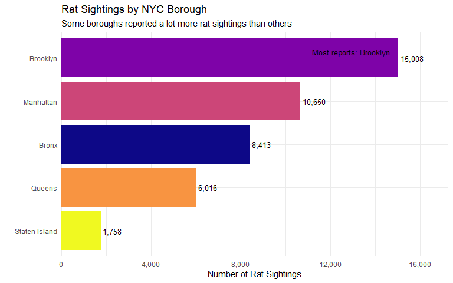
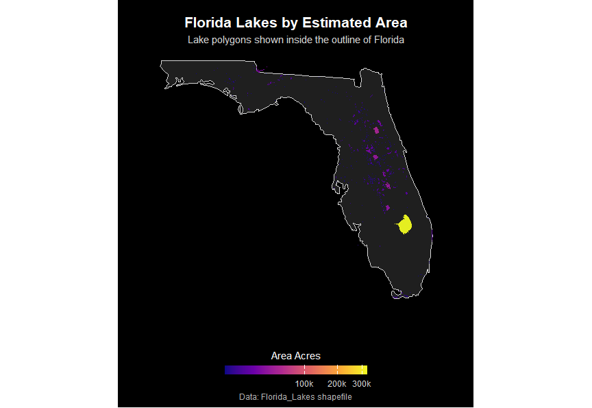
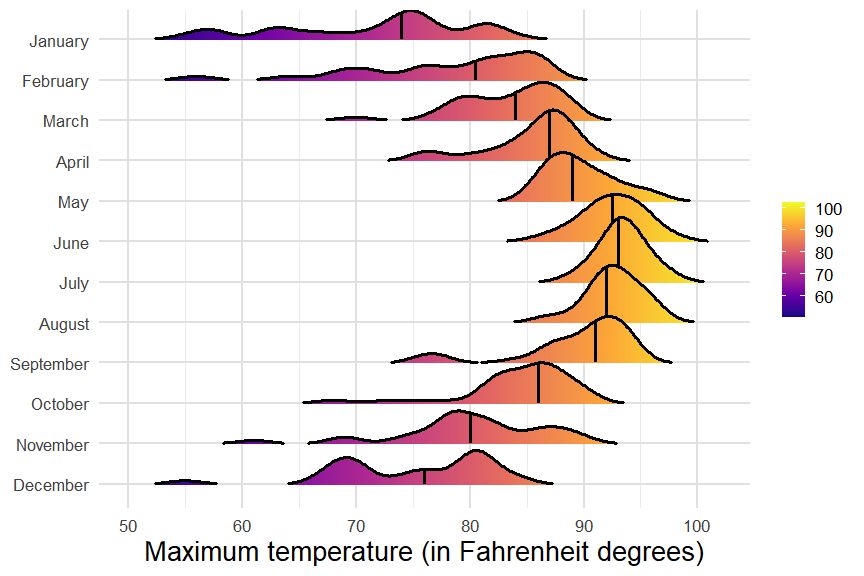

# Data Visualization and Reproducible Research

> Joseph DePalma

This repository contains my final project materials for Data Visualization and Reproducible Research. The projects show revised work from earlier mini-projects along with a final visualization project using Tampa weather data and concrete strength data.

The goal of this final project was to clean up previous work, make the reports more reproducible, improve the visualizations, and include required elements such as an interactive chart, accessibility considerations, and a before/after chart redesign.

## Project 01

In the `project_01/` folder, you can find my revised Mini-Project 1 using the NYC rat sightings dataset. This project explores reported rat sightings by borough, weekday, year, and location type. I also considered how the dataset reflects both rat activity and human reporting behavior, since the data comes from reported sightings rather than direct rat counts.

This revision includes clearer chart design, a weekday bar chart redesign, accessibility updates, and an interactive visualization.

**Favorite visualization:**

My favorite visualization from this project is the rat sightings by borough chart because it quickly shows where reports were most concentrated and gives the project a clear starting point.

## Project 02

In the `project_02/` folder, you can find my revised Mini-Project 2. This project combines multiple visualization types, including time-based birth patterns, Atlanta weather trends, a Florida lakes spatial visualization, and a weather model coefficient plot.

This project gave me more practice with different kinds of data, including dates, maps, interactive heatmaps, and model-based visualizations. The revision focuses on making the charts clearer while keeping the original style of the report.

**Favorite visualization:**

My favorite visualization from this project is the Florida lakes map because it felt like the cleanest spatial visualization in the report. The map makes the data feel more connected to a real place instead of just showing another table or chart. Adding the Florida outline also helped give the lakes more context, so the viewer can understand where the lake data is located instead of just seeing shapes floating by themselves.

## Project 03

In the `project_03/` folder, you can find my final visualization project. The first part recreates several density-based charts using 2022 Tampa weather data from the Florida Climate Center. These include faceted histograms, density plots, a ridgeline plot, and a precipitation summary.

The second part uses the concrete compressive strength dataset. I explored distributions of cement and strength, looked at concrete strength by age, and created a scatterplot showing how cement, age, and water relate to compressive strength.

This project also includes an interactive chart and a before/after redesign section.

**Favorite visualization:**

My favorite visualization from this project is the Tampa temperature ridgeline plot because it makes the seasonal shift across months easy to see while also looking more visually interesting than a basic chart.

## Required Final Project Elements

Each project includes the required final project elements:

* An interactive visualization
* Accessibility improvements, including alt text and readable design choices
* A before/after chart redesign
* Commentary explaining the purpose of the visualizations
* Reproducible code using relative paths where local data files are used

## Moving Forward

This course helped me understand that making a chart is not just about getting code to run. A visualization also has to make sense for the data and for the person reading it. I got more comfortable using `ggplot2`, working with dates, using facets, making maps, and adding interactivity.

Moving forward, I want to keep improving how I explain charts, not just how I create them. I also want to keep practicing interactive and dashboard-style visualizations because they make it easier for someone to explore the data instead of only looking at one static view.
